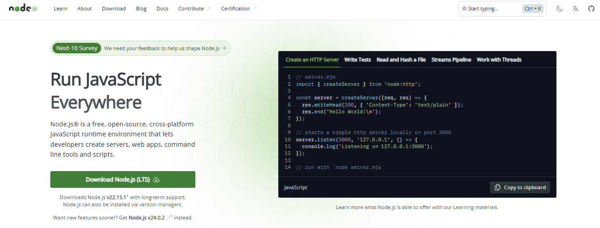

# 🎯 Ouvidoria App - React + TypeScript + Vite

Esta aplicação disponibiliza um formulário online de ouvidoria ao cliente, desenvolvida com React, TypeScript e Chakra UI.</br>A interface foi constituída com TailwindCSS, e a validação dos dados é realizada por meio da biblioteca Zod.

## 📋 Pré Requisitos

```
- Instalação do Node.js
- Scripts Disponíveis
- Estrutura do Projeto
```
<sub>Esse projeto requer:</br>**Node.js v22.11.0 ou superior**.</br>**Instalação das dependências do projeto**</sub>

### Instalação do Node.js

1. **Windows**:

-   Baixe o instalador no [site oficial do Node.js](https://nodejs.org/)



</br>

-   Execute o instalador e siga o assistente de instalação

</br>

2. **macOS**:

```bash
# Usando Homebrew
brew install node
```

3. **Linux**:

```bash
# Usando apt (Ubuntu/Debian)
curl -fsSL https://deb.nodesource.com/setup_22.x | sudo -E bash -
sudo apt-get install -y nodejs

# Usando dnf (Fedora)
sudo dnf install nodejs
```

Verificar a instalação do seu Node.js:

```bash
node --version
# Deve mostar v22.11.0 ou superior
```

## 🚀 Primeiros Passos

Siga estes passos para rodar o projeto localmente:

1. **Clone o repositório**:

```bash
git clone <repository-url>
cd ouvidoria-app
```

2. **Instale as dependências**:

```bash
npm install
```

3. **Inicie o servidor de desenvolvimento**:

```bash
npm run dev
```

4. **Abra o navegador** e acesse:

```
http://localhost:5173
```

## 📝 Scripts Disponíveis

-   **Servidor de desenvolvimento**:

    ```bash
    npm run dev
    ```

-   **Build para produção**:

    ```bash
    npm run build
    ```

-   **Preview do build de produção**:

    ```bash
    npm run preview
    ```

-   **Lint do código**:
    ```bash
    npm run lint
    ```

## 🏗️ Estrutura do Projeto

```
ouvidoria-app/
├── public/           # Static assets
├── src/
│   ├── assets/       # Project assets
|   |── static-files/
│   ├── components/   # React components
│   │   ├── ContactForm.tsx
│   │   ├── Header.tsx
│   │   └── index.ts
│   ├── styles/       # CSS styles
│   ├── App.tsx       # Main App component
│   └── main.tsx      # Entry point
├── index.html        # HTML template
└── vite.config.ts    # Vite configuration
```
